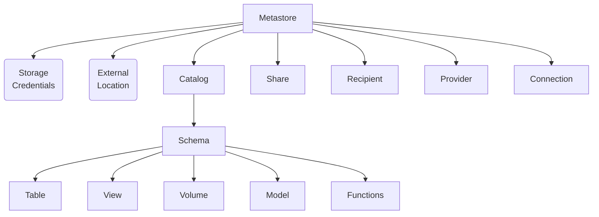

```mermaid
    flowchart TD
        Metastore --> strCred(Storage\nCredentials)
        Metastore --> extLoc(External\nLocation)
        Metastore --> Catalog
        Metastore --> Share
        Metastore --> Recipient
        Metastore --> Provider
        Metastore --> Connection
        Catalog --> Schema
        Schema --> Table
        Schema --> View
        Schema --> Volume
        Schema --> Model
        Schema --> Functions
```